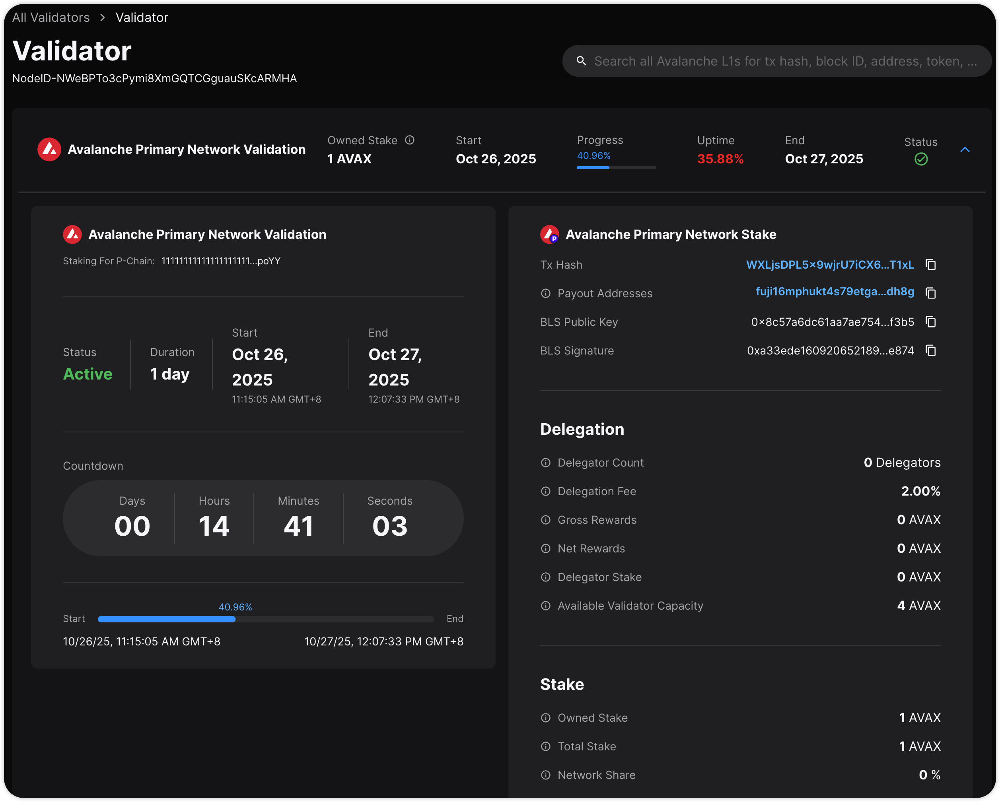

# Register Validator Documentation

## Objective

Validate: Once the node is fully synchronized, register it as a validator on fuji testnet

Lesson Learned: See in [Error Fixed](./error_fixed.md).

## Faucet: Obtain sufficient AVAX for fuji testnet

1.  Go to the Core Wallet Testnet Faucet: `https://core.app/tools/testnet-faucet/`
2.  Paste your **C-Chain Address** (the `0x...` address from MetaMask or Core Wallet).
3.  Enter the discount code: `avalanche-academy`
4.  Click "Request". You should receive test AVAX on the C-Chain.
5.  Inside the Core Wallet, use the **"Bridge"** feature to transfer your AVAX from the **C-Chain** to the **P-Chain**. (Validator staking requires funds on the P-Chain).

## Verify the node is fully synchronized

The node must be fully synced on all three chains (P, X, and C). Run these commands on your EC2 instance.

1.  **Check P-Chain (Most Important):**

    ```bash
    curl -X POST --data '{
        "jsonrpc":"2.0", "id":1, "method" :"info.isBootstrapped",
        "params": {"chain":"P"}
    }' -H 'content-type:application/json;' 127.0.0.1:9650/ext/info
    ```

2.  **Check C-Chain:**

    ```bash
    curl -X POST --data '{
        "jsonrpc":"2.0", "id":1, "method" :"info.isBootstrapped",
        "params": {"chain":"C"}
    }' -H 'content-type:application/json;' 127.0.0.1:9650/ext/info
    ```

3.  **Check X-Chain:**

    ```bash
    curl -X POST --data '{
        "jsonrpc":"2.0", "id":1, "method" :"info.isBootstrapped",
        "params": {"chain":"X"}
    }' -H 'content-type:application/json;' 127.0.0.1:9650/ext/info
    ```

**Goal:** All three commands must return `{"result":{"isBootstrapped":true}}`.

## Register as a validator

1.  **Get your NodeID:** Run this on your EC2 instance.

    ```bash
    curl -X POST --data '{
        "jsonrpc":"2.0",
        "id"     :1,
        "method" :"info.getNodeID"
    }' -H 'content-type:application/json;' 127.0.0.1:9650/ext/info
    ```

      * Copy the `nodeID` from the response (e.g., `NodeID-...`).

2.  **Get your BLS Keys (Proof of Possession):** Run this on your EC2 instance.

    ```bash
    sudo docker logs avalanchego-fuji 2>&1 | grep "nodePOP"
    ```

      * This will print a log line. Find the `nodePOP` JSON structure inside it.
      * Copy the **`publicKey`** (e.g., `0x8c57...`).
      * Copy the **`proofOfPossession`** (e.g., `0xa33e...`).

3.  **Go to the Core Wallet UI** (`https://core.app/`) on your local machine.
4.  Click **"Stake"** on the left menu, then go to the **"Validate"** tab.
5.  Click the **"Add Validator"** button.
6.  Fill out the form:

      * **Node ID:** Paste the `NodeID-` you got from Step 1.
      * **Stake Amount:** Enter `1` (or more). **DO NOT** stake your full balance; leave \~0.1 AVAX for gas fees.
      * **Staking End Date:** Select a date **14 days** in the future (the minimum duration).
      * **BLS Public Key:** Paste the `publicKey` you got from Step 2.
      * **BLS Signature:** Paste the `proofOfPossession` you got from Step 2.
      * **Delegation Fee:** Enter `2` (the minimum %).
      * **Reward Address:** Leave it as "Use this wallet".

7.  Click **"Submit"** and approve the transaction in your wallet.

## Verify the node is a validator

1.  Open the Fuji Testnet Explorer in your browser: `https://subnets-test.avax.network/p-chain`
2.  Paste your **NodeID** (e.g., `NodeID-...`) into the search bar.
3.  You will land on your validator's dashboard page. This is the **"Testnet explorer dashboard URL"** required as a deliverable.
4.  You will initially see your status as **"Pending"**. This is normal. It will change to **"Active"** when the next validation cycle begins (this can take a few hours).



## Automated testing

We can simplify the checks above by running a playbook on local machine.

```bash
cd ansible
ansible-playbook monitor.yml
```